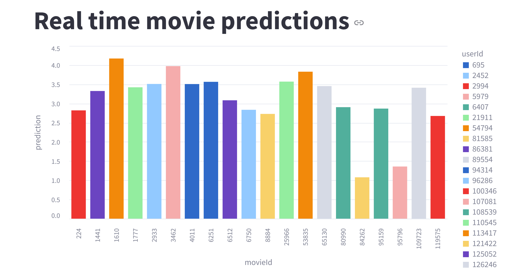
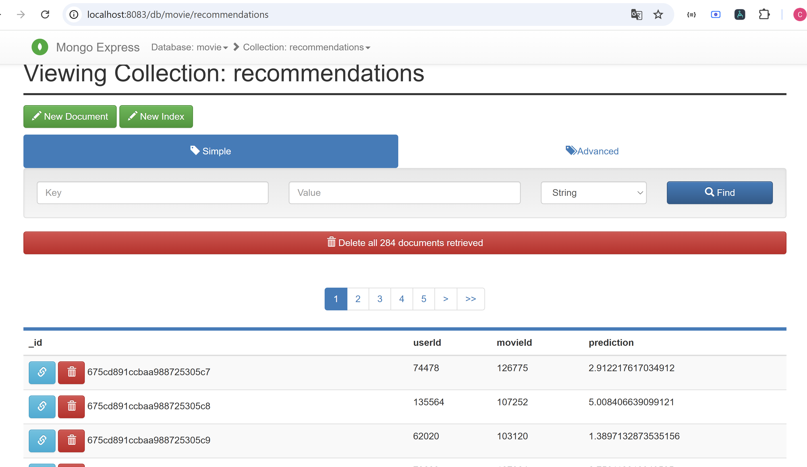

# MovieRecommendation

1. `docker-compose up -d`

2. `docker cp ./rating.csv namenode:/home`

3. `docker cp ./movie.csv namenode:/home`

4. `docker exec -it namenode bash`

5. "root@ecb9d6d3c7b6:/#" `hdfs dfs -mkdir /data`

6. "root@ecb9d6d3c7b6:/#" `hdfs dfs -put /home/* /data`

7. `docker logs pyspark_notebook` ==> Click on link started by `https://127.0.0.1:8888/lab?token= ...` with the associeted token.

8. Once on this, open the `work` folder and `etl.ipynb` file then execute one script section by one until the end to save model under `data` folder on hdfs server in `namenode` service.

9. Come back in your container `pyspark_notebook` and run the following command : `python Simulateur_kafka.py`. After that you will see the messages sent. Don't Stop that !!

10. In your browser open the `mongo-express` service to master your database waiting your movies prediction. Open that using this link : `http://localhost:8083/`

11. Once on the `mongo-express` interface, add a new database named `movie` and `recommendations` collection.

12. Open a new terminal and launch this command in your `pyspark_notebook` container : `streamlit run consumer.py` will allows at the end to see movies recommendation by movies rating prediction and to stock at the same time recommendations in your `movie` database.

13. You will see this kind of thing on `streamlit`:

and  on `mongo-express` interface.
